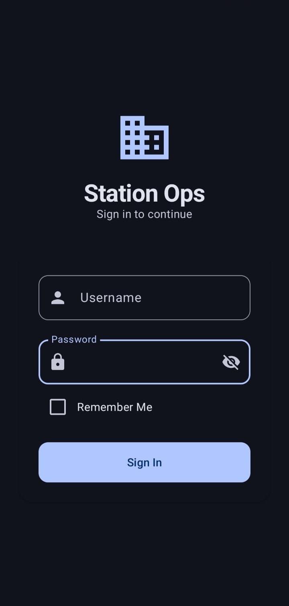
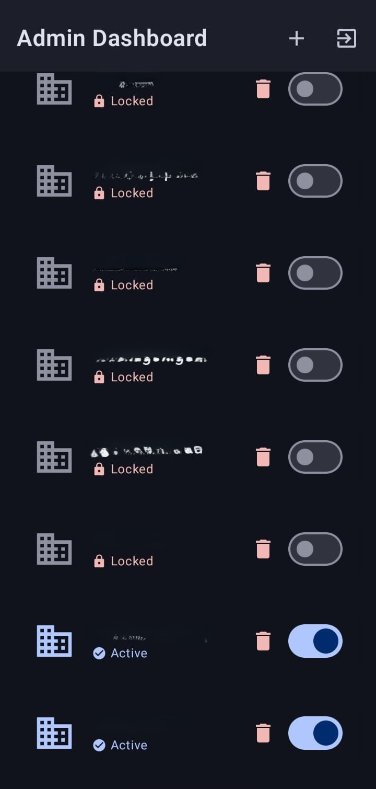
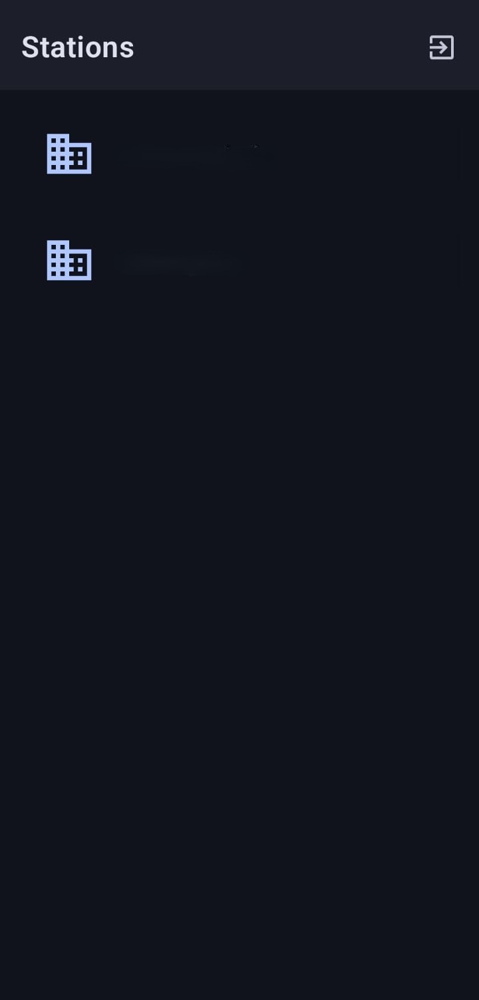

# Station Ops

An Android application for managing station operations with role-based access control, real-time data synchronization, and secure file management. Built with Jetpack Compose and Firebase.

## Features

- **Role-Based Authentication** — Supports Admin and User roles with Firebase Authentication and encrypted credential storage
- **Station Management** — Create, view, and manage operational stations with real-time status tracking
- **File Operations** — Capture photos, upload documents (images, PDFs), and manage station files with Firebase Cloud Storage
- **Real-Time Sync** — Cloud Firestore integration for live station data and upload tracking across devices
- **Secure Storage** — Credentials encrypted locally using Android's EncryptedSharedPreferences
- **Dark Mode** — Full light and dark theme support with Material 3 dynamic colors (Android 12+)

## Screenshots

### Login Screen

### Admin Dashboard

### Employee Dashboard

### Employee Upload


## Architecture

The project follows the **MVVM (Model-View-ViewModel)** pattern:

```
com.example.stationops
├── data
│   ├── local           # SecureStorage (encrypted credentials)
│   ├── model           # Data classes (Station, Upload, User)
│   └── repository      # AuthRepository, StationRepository
├── ui
│   ├── dashboard       # Station list with admin controls
│   ├── login           # Authentication screen
│   ├── station_detail  # File management per station
│   ├── theme           # Material 3 theming (Color, Type, Theme)
│   └── Routes.kt      # Centralized navigation routes
└── MainActivity.kt     # Single-activity entry point with NavHost
```

## Tech Stack

| Layer | Technology |
|-------|-----------|
| UI | Jetpack Compose, Material 3, Material Icons Extended |
| Navigation | Navigation Compose |
| Backend | Firebase Authentication, Cloud Firestore, Cloud Storage |
| Image Loading | Coil |
| Security | AndroidX Security Crypto (EncryptedSharedPreferences) |
| Build | Gradle Kotlin DSL, Version Catalogs |
| Language | Kotlin |

## Requirements

- Android Studio Ladybug or newer
- JDK 11+
- Android SDK 36 (minimum SDK 24)
- A Firebase project with Authentication, Firestore, and Storage enabled

## Setup

1. Clone the repository:
   ```bash
   git clone https://github.com/<your-username>/station-ops-android.git
   ```

2. Open the project in Android Studio.

3. Create a Firebase project at [Firebase Console](https://console.firebase.google.com/) and enable:
   - **Authentication** (Email/Password sign-in method)
   - **Cloud Firestore** (create a database)
   - **Cloud Storage** (set up default bucket)

4. Register an Android app in Firebase with your chosen application ID (e.g., `com.example.stationops`).

5. Download `google-services.json` from your Firebase project and place it in the `app/` directory.

6. *(Optional)* Customize local build values by adding the following to `local.properties`:
   ```properties
   app.name=My Custom Name
   app.id=com.example.myapp
   app.email.domain=myapp.example.com
   ```
   These override the defaults at build time. If omitted, the app uses `Station Ops` / `com.example.stationops` / `stationops.app`.

7. Build and run:
   ```bash
   ./gradlew assembleDebug
   ```

## Firebase Configuration

### Authentication

The app constructs login emails as `<username>@<EMAIL_DOMAIN>`. Create users in Firebase Authentication using this format. The email domain is configured via `local.properties` or defaults to `stationops.app`.

### Firestore Collections

Create the following collections in Cloud Firestore:

**`users`** — User profiles (document ID = Firebase Auth UID)
| Field | Type | Description |
|-------|------|-------------|
| `uid` | string | Firebase Auth UID |
| `email` | string | User email address |
| `role` | string | `"admin"` or `"employee"` |

**`stations`** — Managed stations
| Field | Type | Description |
|-------|------|-------------|
| `name` | string | Station display name |
| `isUploadEnabled` | boolean | Whether file uploads are allowed |
| `createdBy` | string | UID of the admin who created it |

**`uploads`** — Files uploaded to stations
| Field | Type | Description |
|-------|------|-------------|
| `url` | string | Firebase Storage download URL |
| `type` | string | `"image"` or `"pdf"` |
| `uploaderId` | string | UID of the uploader |
| `stationId` | string | ID of the parent station |
| `timestamp` | timestamp | Upload time |

### Storage

Files are stored in Firebase Cloud Storage under paths structured by station. No special rules are required beyond the default authenticated read/write.


